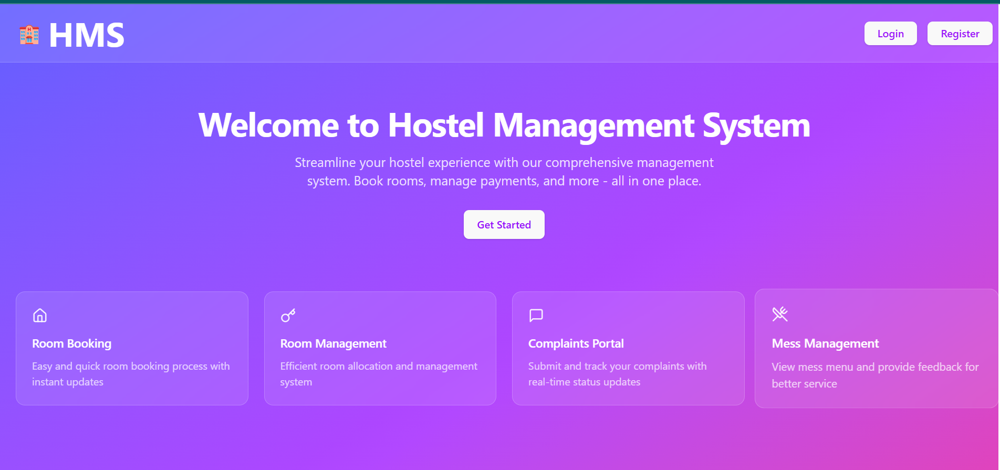

# React + Vite

This template provides a minimal setup to get React working in Vite with HMR and some ESLint rules.

Currently, two official plugins are available:

- [@vitejs/plugin-react](https://github.com/vitejs/vite-plugin-react/blob/main/packages/plugin-react) uses [Babel](https://babeljs.io/) for Fast Refresh
- [@vitejs/plugin-react-swc](https://github.com/vitejs/vite-plugin-react/blob/main/packages/plugin-react-swc) uses [SWC](https://swc.rs/) for Fast Refresh

## Expanding the ESLint configuration

If you are developing a production application, we recommend using TypeScript with type-aware lint rules enabled. Check out the [TS template](https://github.com/vitejs/vite/tree/main/packages/create-vite/template-react-ts) for information on how to integrate TypeScript and [`typescript-eslint`](https://typescript-eslint.io) in your project.

## Screenshots

### Landing Page

### Login Page

### Registration Page

### Dashboard Page

## Project Instructions

### Prerequisites
- Node.js and npm installed on your machine.

### Installation
1. Clone the repository.
2. Navigate to the `frontend/HMS` directory.
3. Run `npm install` to install dependencies.

### Running the Project
- Run `npm run dev` to start the development server.
- Open the provided localhost URL in your browser to view the app.

### Building for Production
- Run `npm run build` to create a production build.

### Additional Notes
- This project uses React with Vite for fast development.
- ESLint is configured for code quality.

## Project Structure

- `frontend/HMS/src/` - Contains all the React source code.
  - `assets/` - Static assets like images and icons.
  - `components/` - Reusable UI components.
  - `components/layouts/` - Layout components for different page structures.
  - `components/forms/` - Form components used in the app.
  - `components/ui/` - UI elements like buttons, inputs, cards, etc.
  - `context/` - React context providers for state management.
  - `pages/` - Page components for routing.
    - `auth/` - Authentication related pages (Login, Register).
    - `dashboard/` - Dashboard related pages.
    - `admin/` - Admin panel pages.
  - `lib/` - Utility functions and helpers.
  - `config.js` - Configuration file for the frontend.
  - `App.jsx` - Main React app component.
  - `main.jsx` - Entry point for React app.

- `backend/` - Contains backend server code.
  - `models/` - Database models.
  - `routes/` - API route handlers.
  - `middleware/` - Express middleware.
  - `utils/` - Utility scripts.
  - `index.js` - Backend server entry point.

## Project Plan

1. **Frontend Development**
   - Build reusable UI components.
   - Implement authentication pages (Login, Register).
   - Develop landing and dashboard pages.
   - Manage state using React Context.
   - Integrate API calls to backend.

2. **Backend Development**
   - Design database schema with models.
   - Implement RESTful API routes.
   - Add authentication and authorization middleware.
   - Handle business logic and data validation.
   - Manage notifications, payments, complaints, and room bookings.

3. **Testing & Deployment**
   - Write unit and integration tests.
   - Set up CI/CD pipelines.
   - Deploy frontend and backend to hosting services.
   - Monitor and maintain the application.

This structure and plan provide a clear overview of the project organization and development workflow.
